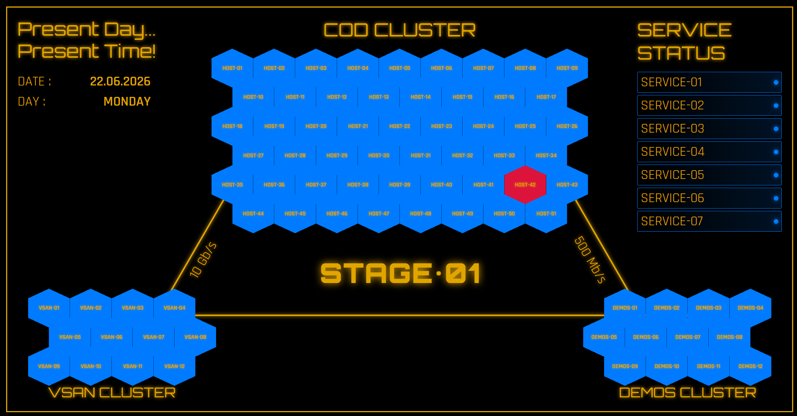

# Cyber Dashboard



Мониторинг-дашборд для отслеживания состояния серверов и сервисов с визуализацией в киберпанк-стиле. Шестиугольники, анимированные гифки и полный контроль над тем, что и как отображается. Названия блоков из продакшена, поддаются замене.

## Оглавление

- [Установка](#установка)
- [Расположение файлов](#расположение-файлов)
- [Запуск](#запуск)
- [Systemd сервис](#systemd-сервис)
- [Управление конфигами](#управление-конфигами)
- [Управление гифками](#управление-гифками)
- [API](#api)

---

## Установка

### Зависимости

```bash
pip install flask ping3 
```

### Клонирование репозитория

```bash
git clone https://github.com/shanuan1337/cyber-dashboard.git /opt/dashboard
cd /opt/dashboard
```

### Структура проекта

```text
/opt/dashboard/
├── app.py                     # Основное приложение Flask
├── manage_gifs.py             # CLI-утилита для управления гифками
├── cyber-dashboard.service    # Systemd unit файл
├── config/
│   ├── top_hosts.json         # Главный кластер (51 хост)
│   ├── side_status.json       # Боковые сервисы (7 шт)
│   ├── vsan_cluster.json      # VSAN кластер (12 хостов)
│   ├── demos_cluster.json     # DEMOS кластер (12 хостов)
│   └── gifs_config.json       # Конфиг анимированных гифок
├── static/gifs/               # Директория с гифками
├── templates/
│   └── index.html             # Главная страница дашборда
└── demo.png                   # Скриншот для README
```

### Настройка логов

```bash
mkdir -p /var/log/dashboard
chown -R root:root /var/log/dashboard
```

## Запуск

### Тестовый запуск (для отладки)

```bash
cd /opt/dashboard
python3 app.py
```

Дашборд будет доступен по адресу: `http://localhost:5000`

### Продакшен-запуск через systemd

```bash
systemctl daemon-reload
systemctl enable cyber-dashboard.service
systemctl start cyber-dashboard.service
```

### Проверка статуса

```bash
systemctl status cyber-dashboard.service
journalctl -u cyber-dashboard.service -f
```

## Systemd сервис

Файл: `/etc/systemd/system/cyber-dashboard.service`

```ini
[Unit]
Description=Cyber Dashboard Monitoring
After=network.target

[Service]
Type=simple
User=root
Group=root
WorkingDirectory=/opt/dashboard
ExecStart=/usr/bin/python3 /opt/dashboard/app.py
Restart=always
RestartSec=5
StandardOutput=append:/var/log/dashboard/app.log
StandardError=append:/var/log/dashboard/error.log

[Install]
WantedBy=multi-user.target
```

> **Важно:** Сервис запускается от `root` для корректного разрешения DNS-имён и работы `ping`.

## Управление конфигами

Все конфиги лежат в `/opt/dashboard/config/` в формате JSON.

### Формат конфигов

**top_hosts.json** — главный кластер:

```json
{
  "title": "MAIN CLUSTER",
  "hosts": [
    {"id": "host1", "label": "HOST-01", "address": "10.1.1.1"},
    {"id": "host2", "label": "HOST-02", "address": "server.corp.ru"}
  ]
}
```

**Поля:**

| Поле | Описание |
| :--- | :--- |
| `id` | Уникальный идентификатор (используется в коде) |
| `label` | Отображаемое имя на шестиугольнике |
| `address` | IP или hostname (резолвится через DNS) |

Аналогичная структура для:
- `vsan_cluster.json` — VSAN кластер
- `demos_cluster.json` — DEMOS кластер
- `side_status.json` — сервисы на правой панели

**После изменения конфигов:**

```bash
systemctl restart cyber-dashboard.service
```

## Управление гифками

Утилита `manage_gifs.py` позволяет добавлять, удалять и настраивать анимированные гифки на дашборде.

### Команды

```bash
cd /opt/dashboard

# Показать все гифки
python3 manage_gifs.py list

# Добавить новую гифку (интерактивно)
python3 manage_gifs.py add

# Удалить гифку
python3 manage_gifs.py remove

# Включить/выключить гифку
python3 manage_gifs.py toggle

# Изменить слой (z-index)
python3 manage_gifs.py layer

# Изменить прозрачность
python3 manage_gifs.py opacity

# Редактировать гифку
python3 manage_gifs.py edit

# Справка
python3 manage_gifs.py help
```

### Добавление гифки

1. Положи `.gif` файл в `/opt/dashboard/static/gifs/`
2. Запусти `python3 manage_gifs.py add`
3. Введи ID и имя файла
4. Настрой позиционирование (центр, углы, отступы)
5. Выбери слой (фон/середина/передний план)
6. Настрой прозрачность (0.0–1.0)

### Структура гифки в конфиге

```json
{
  "id": "heartbeat",
  "url": "/static/gifs/heartbeat.gif",
  "position": {
    "center_both": true,
    "transform": "scale(1.2)"
  },
  "size": {
    "width": "600px",
    "height": "600px"
  },
  "opacity": 1.0,
  "zIndex": 2000,
  "enabled": true,
  "blend_mode": "screen",
  "filter": "brightness(1.2)"
}
```

### Слои (z-index)

| Слой | Диапазон z-index | Описание |
| :--- | :--- | :--- |
| Фон | 5–100 | Позади контента |
| Середина | 101–1999 | Между элементами |
| Передний план | 2000+ | Поверх всего |

## API

Дашборд предоставляет API для интеграции:

### Статусы всех хостов

```bash
curl http://localhost:5000/api/status
```

**Ответ:**

```json
{
  "datetime": {"date": "22.06.2026", "day": "MONDAY", "time": "12:00:00"},
  "top_hosts": {"host1": {"status": "up", "response_time": 12.5}},
  "side_services": {"SERVICE-01": {"status": "down", "response_time": null}},
  "vsan_hosts": {"vsan1": {"status": "up", "response_time": 5.2}},
  "demos_hosts": {"demos1": {"status": "up", "response_time": 8.1}}
}
```

### Конфиг гифок

```bash
curl http://localhost:5000/api/gifs-config
```

### Health check

```bash
curl http://localhost:5000/health
```

## Полезные команды

| Действие | Команда |
| :--- | :--- |
| Перезапуск сервиса после изменений | `systemctl restart cyber-dashboard.service` |
| Просмотр логов в реальном времени | `journalctl -u cyber-dashboard.service -f` |
| Проверка работы порта | `netstat -tlnp \| grep 5000` |
| Тестовый пинг хоста из конфига | `ping -c 3 google.com` |

## Лицензия

MIT License — делай что хочешь, но без гарантий.
